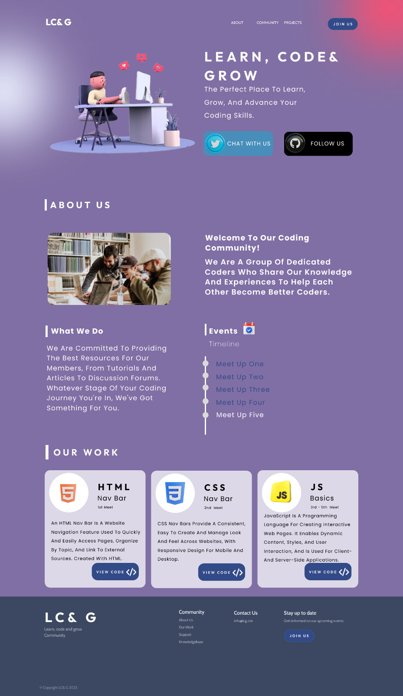

# 💻LCG (Learn Code and Grow)

This is a 👐 community where we help each other grow. 

> Link to figma file [here](https://www.figma.com/file/wKVEmN4WKVAZCeBEwhAvYH/Untitled?node-id=0%3A1&t=Res45b52njY2m1uJ-1)

<br>

### 🚀 About

LCG is an open-source community project.It is a website for our local community.

<br>

### 🧰 Languages / Tools

For the project decided to use these technologies:

-   Frontend

    -   JavaScript
    -   HTML
    -   CSS

-   Backend
    -   NodeJs
    -   Express
    -   MongoDB

<br>

## 🧑🏾‍💻 Demo (👷‍♂️work-in progress)

Check out the website: [LCG](https://codedwells.github.io/LCG)

<br>

## 👌🏾 What you have to do to contribute

-   [Read the rules](https://github.com/Codedwells/LCG/blob/main/CONTRIBUTING.md#rules)

<br>

## 🥂 After making a change

1. Create a new branch

```bash
git checkout -b YourBranchName
```

2. Add it to staging area

<br>

> NOTE: don't commit the package.json

```bash
git add <path to the file you worked on>
```

3. Commit your changes with

```bash
git commit -m "Your commit message"
```

4. Push your changes

```bash
git push
```

## 👨‍👩‍👦 Community

> **🐦Twitter comming soon**

<br>

## 👩🏽‍💻 Contributing

-   Contributions make the open source community such an amazing place to learn, inspire, and create.
-   Any contributions you make are greatly appreciated.
-   Check out our [contribution guidelines](/CONTRIBUTING.md) for more information.

<br>

## 🛡️ License

LCG is licensed under the MIT License - see the [LICENSE](LICENSE) file for details.

<br>

## 💪🏽 Thanks to all the awesome Contributors

Thanks a lot for spending your time helping LCG grow. Thanks a lot! Keep rocking🍻


## 🙏🏽 Support

This project needs a star️ from you. Don't forget to leave a star✨
